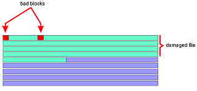

<div align="center">

## Restore data from damadged flopy


</div>

### Description

Have U ever saved something on the flopy that could not be retrived due 2 damadged floppy? U insert flopy and try to copy damadged file. Explorer stops saying: "CANNOT READ DRIVE A:" and even ScanDisk cannot repair errors on disk. Well, you could try my VB solution to this problem. It is very easy, effective, and it works. Ok, output file has some errors, but it is beter to have 99% of your data retrived than 0. Don't u agree?
 
### More Info
 
damadged file on floppy

restored file on your local disk


<span>             |<span>
---                |---
**Submitted On**   |
**By**             |[Sebastjan Dobnik](https://github.com/Planet-Source-Code/PSCIndex/blob/master/ByAuthor/sebastjan-dobnik.md)
**Level**          |Beginner
**User Rating**    |5.0 (20 globes from 4 users)
**Compatibility**  |VB 3\.0, VB 4\.0 \(16\-bit\), VB 4\.0 \(32\-bit\), VB 5\.0, VB 6\.0, VB Script, ASP \(Active Server Pages\) 
**Category**       |[Debugging and Error Handling](https://github.com/Planet-Source-Code/PSCIndex/blob/master/ByCategory/debugging-and-error-handling__1-26.md)
**World**          |[Visual Basic](https://github.com/Planet-Source-Code/PSCIndex/blob/master/ByWorld/visual-basic.md)
**Archive File**   |[](https://github.com/Planet-Source-Code/sebastjan-dobnik-restore-data-from-damadged-flopy__1-9243/archive/master.zip)


### Source Code

```
Private Sub Command1_Click()
  Dim Buffer As String
  Dim Location As Single
  Dim Lenght As Single
  Dim ErrCount As Single
  Open "a:\DamadgedFile.dat" For Binary As #1     'the file that is damadged
  Open "c:\temp\DamadgedFile.dat" For Binary As #2   'copy of damadged file (in my case in folder C:\temp)
  Lenght = LOF(1)
  On Error Resume Next
  Buffer = Space(1)
  For Location = 1 To Lenght
    Get #1, Location, Buffer
    If Err <> 0 Then
      ErrCount = ErrCount + 1
      Debug.Print "ERROR no.: " + Format$(ErrCount) + ". Cannot read data on location" + Format$(Location)
      Buffer = " "  'change damadged data with space
      Err.Clear
    End If
    Put #2, Location, Buffer
  Next
  Close
  x = MsgBox("Done")
  End
  'Go to c:\temp\DamadgedFile.dat" and try to open it...
  'most Word, Excel, CDR, jpg, bmp, ..... and other file tipes will open with no
  'significant errors in the content...
  '
  'Well, hope this helps u restore your data...
End Sub
```

